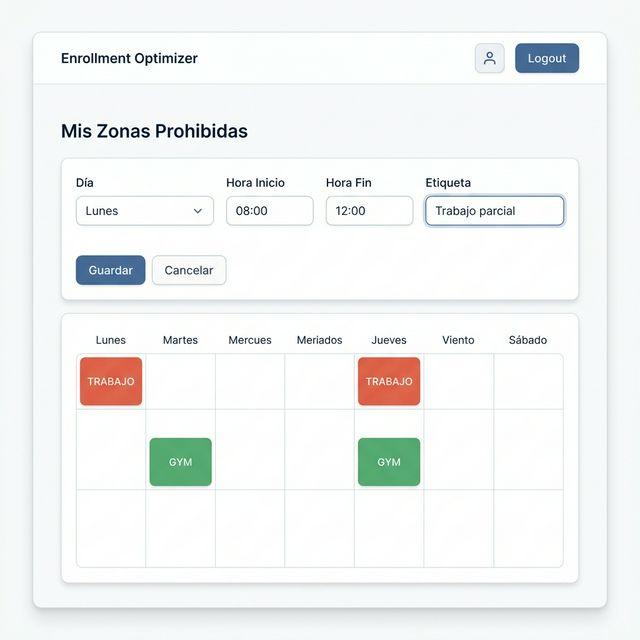
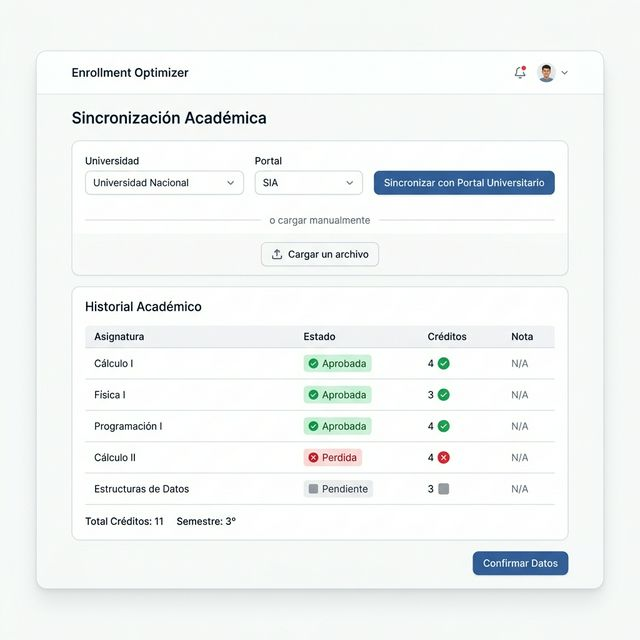
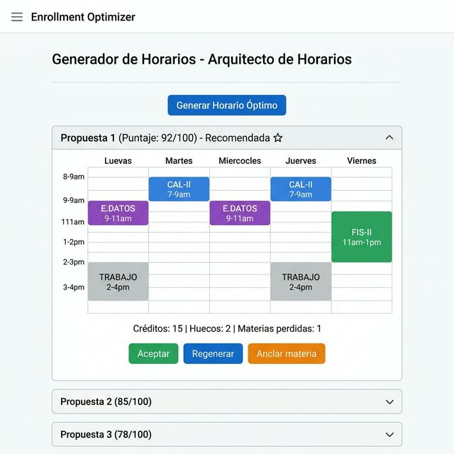
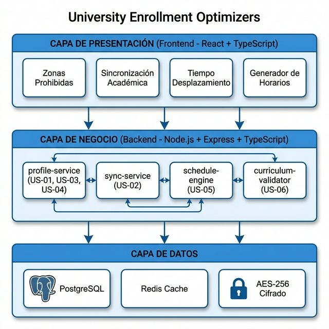
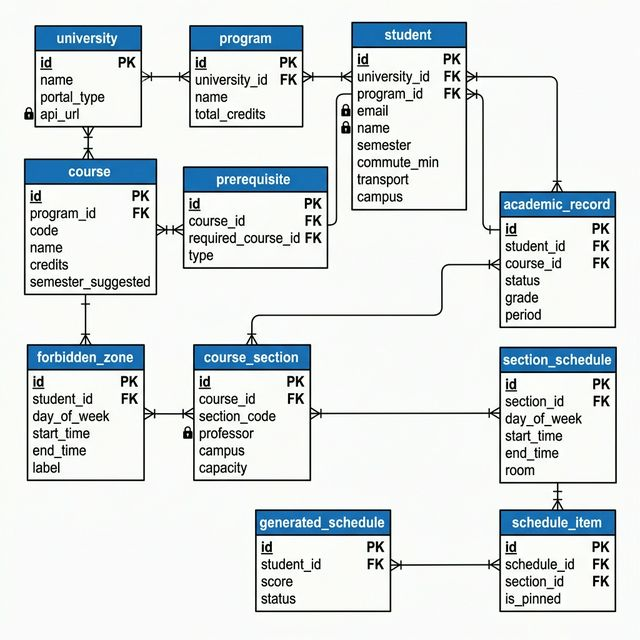
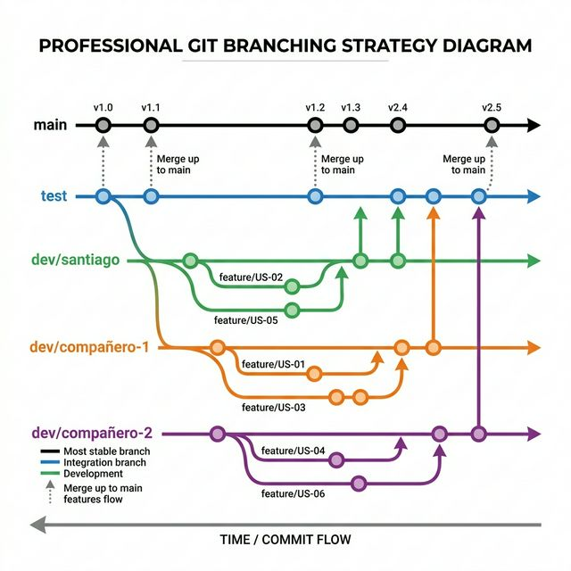

# Documento Maestro de Ingeniería de Software — Sprint 1

**Proyecto:** Enrollment Optimizer — Optimizador de Matrículas Académicas
**Propuesta de valor:** "Sincronizamos la vida real con el éxito académico."
**Equipo:** 3 desarrolladores
**Duración del Sprint:** 3 semanas
**Historias del Sprint:** US-01 a US-06
**Fecha:** 19 de marzo de 2026

---

## Tabla de Contenido

1. Definición y Análisis de Requerimientos
2. Diseño de la Experiencia (Mockups)
3. Arquitectura del Sistema
4. Diseño de Datos (ERD)
5. Stack Tecnológico
6. Estrategia de Git y Repositorios

---

# 1. DEFINICIÓN Y ANÁLISIS DE REQUERIMIENTOS

## Épica 1: Perfil de Vida y Onboarding

---

## US-01: Configuración de "Zonas Prohibidas"

**Historia de Usuario:** Como estudiante, quiero mapear mis horarios de trabajo y bienestar para que el sistema no me asigne clases en esos bloques.

**Puntos de historia:** 3
**Prioridad:** Highest
**Épica:** Perfil de Vida y Onboarding

### Requerimientos Funcionales

| ID | Descripción |
|---|---|
| RF-01.1 | El sistema debe permitir al estudiante agregar bloques de tiempo con día, hora inicio, hora fin y etiqueta (ej: "Trabajo", "Gimnasio", "Cuidado familiar"). |
| RF-01.2 | El sistema debe permitir editar y eliminar zonas prohibidas existentes. |
| RF-01.3 | El sistema debe validar que no se solapen zonas prohibidas entre sí. |
| RF-01.4 | El sistema debe mostrar una vista semanal visual con las zonas prohibidas marcadas. |
| RF-01.5 | El sistema debe persistir las zonas para que estén disponibles al generar horarios (US-05). |

### Requerimientos No Funcionales

| ID | Descripción |
|---|---|
| RNF-01.1 | Las zonas prohibidas deben guardarse cifradas en la base de datos (relación con US-04). |
| RNF-01.2 | La interfaz debe responder en menos de 200ms al agregar/editar una zona. |
| RNF-01.3 | Debe funcionar correctamente en pantallas móviles (responsive). |

### Criterios de Aceptación

- El estudiante puede crear mínimo 1 zona prohibida con día, hora inicio, hora fin y etiqueta.
- El sistema impide crear zonas que se solapen.
- Las zonas se visualizan en un calendario semanal.
- Las zonas persisten tras cerrar sesión.

---

## US-02: Sincronización de Estado Académico

**Historia de Usuario:** Como estudiante, quiero que el sistema se conecte con el portal de la universidad (SIA/Banner) para cargar automáticamente mi historial de materias aprobadas y perdidas.

**Puntos de historia:** 8
**Prioridad:** Highest
**Épica:** Perfil de Vida y Onboarding

### Requerimientos Funcionales

| ID | Descripción |
|---|---|
| RF-02.1 | El sistema debe proveer un mecanismo para conectarse al portal académico de la universidad (API o scraping). |
| RF-02.2 | El sistema debe extraer: materias aprobadas, materias perdidas, créditos acumulados y semestre actual. |
| RF-02.3 | El sistema debe mapear las materias extraídas al pensum interno del sistema. |
| RF-02.4 | El sistema debe permitir sincronización manual (botón "Actualizar") y automática (al inicio de sesión). |
| RF-02.5 | El sistema debe mostrar un resumen del historial académico importado para que el estudiante lo confirme. |
| RF-02.6 | En caso de fallo de conexión, el sistema debe permitir carga manual de materias aprobadas como alternativa. |

### Requerimientos No Funcionales

| ID | Descripción |
|---|---|
| RNF-02.1 | La sincronización no debe tardar más de 10 segundos. |
| RNF-02.2 | Las credenciales del portal universitario NO deben almacenarse; usar tokens de sesión temporal. |
| RNF-02.3 | Los datos académicos deben cifrarse en reposo (AES-256) según US-04. |
| RNF-02.4 | El conector debe seguir el patrón Strategy para soportar múltiples universidades (Banner, SIA, PeopleSoft). |

### Criterios de Aceptación

- El estudiante puede iniciar la sincronización con un clic.
- El sistema extrae correctamente materias aprobadas y perdidas.
- El historial se muestra para confirmación del estudiante.
- En caso de fallo, se ofrece carga manual.
- Los datos quedan cifrados en la base de datos.

---

## US-03: Definición de Tiempos de Desplazamiento

**Historia de Usuario:** Como estudiante, quiero ingresar cuánto tardo en llegar a la universidad para asegurar que el horario propuesto sea logísticamente viable.

**Puntos de historia:** 4
**Prioridad:** High
**Épica:** Perfil de Vida y Onboarding

### Requerimientos Funcionales

| ID | Descripción |
|---|---|
| RF-03.1 | El sistema debe permitir al estudiante ingresar su tiempo de desplazamiento en minutos. |
| RF-03.2 | El sistema debe permitir diferenciar tiempos según medio de transporte (bus, carro, bicicleta, a pie). |
| RF-03.3 | El sistema debe considerar el tiempo de desplazamiento al proponer horarios (US-05), evitando clases consecutivas que no den tiempo de llegada. |
| RF-03.4 | El sistema debe permitir definir tiempos distintos por campus (si la universidad tiene varias sedes). |

### Requerimientos No Funcionales

| ID | Descripción |
|---|---|
| RNF-03.1 | El formulario debe validar que el tiempo sea un número positivo entre 1 y 180 minutos. |
| RNF-03.2 | El dato se almacena cifrado como parte del perfil del estudiante (US-04). |

### Criterios de Aceptación

- El estudiante puede ingresar su tiempo de desplazamiento.
- El sistema valida que el valor sea razonable (1-180 min).
- El generador de horarios (US-05) respeta este tiempo entre clases.

---

## US-04: Cifrado de Datos Personales

**Historia de Usuario:** Como usuario, quiero que mi información de horarios personales esté cifrada y no sea visible para otros estudiantes para proteger mi privacidad.

**Puntos de historia:** 5
**Prioridad:** Highest
**Épica:** Perfil de Vida y Onboarding

### Requerimientos Funcionales

| ID | Descripción |
|---|---|
| RF-04.1 | El sistema debe cifrar en reposo todos los datos personales del estudiante (zonas prohibidas, historial académico, tiempos de desplazamiento). |
| RF-04.2 | El sistema debe usar cifrado AES-256 para datos en reposo. |
| RF-04.3 | El sistema debe usar HTTPS/TLS 1.3 para datos en tránsito. |
| RF-04.4 | Ningún endpoint de la API debe exponer datos personales de un estudiante a otro estudiante. |
| RF-04.5 | El sistema debe generar y gestionar claves de cifrado de forma segura (vault o variable de entorno protegida). |

### Requerimientos No Funcionales

| ID | Descripción |
|---|---|
| RNF-04.1 | Cumplimiento con la Ley 1581 de Protección de Datos Personales (Colombia) y estándares GDPR. |
| RNF-04.2 | Las claves de cifrado nunca deben estar en el código fuente ni en el repositorio. |
| RNF-04.3 | Los logs del sistema no deben contener datos personales en texto plano. |
| RNF-04.4 | Latencia máxima añadida por el cifrado/descifrado: 50ms. |

### Criterios de Aceptación

- Los datos personales se almacenan cifrados en la base de datos.
- Un query directo a la BD no muestra datos en texto plano.
- La API no expone datos de un estudiante a otro.
- Las claves se manejan por variables de entorno, no hardcodeadas.

---

## Épica 2: El Arquitecto de Horarios

---

## US-05: Generación de Horario Óptimo Proactivo

**Historia de Usuario:** Como estudiante, quiero recibir una propuesta de horario que maximice mi avance curricular respetando mis restricciones personales.

**Puntos de historia:** 13
**Prioridad:** Highest
**Épica:** El Arquitecto de Horarios

### Requerimientos Funcionales

| ID | Descripción |
|---|---|
| RF-05.1 | El sistema debe recibir como entrada: historial académico (US-02), zonas prohibidas (US-01), tiempo de desplazamiento (US-03) y oferta académica del semestre. |
| RF-05.2 | El sistema debe generar al menos 3 propuestas de horario ordenadas por puntaje de satisfacción. |
| RF-05.3 | El puntaje debe considerar: maximización de créditos, minimización de huecos, respeto de zonas prohibidas y priorización de materias perdidas (repitencia). |
| RF-05.4 | El sistema debe invocar la validación de prerrequisitos (US-06) antes de incluir una materia en la propuesta. |
| RF-05.5 | El sistema debe permitir al estudiante "anclar" una materia/sección específica y regenerar alrededor de ella. |
| RF-05.6 | El sistema debe mostrar el horario propuesto en formato visual (calendario semanal) con código de colores por materia. |
| RF-05.7 | El estudiante debe poder aceptar, rechazar o modificar manualmente la propuesta. |

### Requerimientos No Funcionales

| ID | Descripción |
|---|---|
| RNF-05.1 | El algoritmo debe generar las propuestas en menos de 5 segundos para un pensum de hasta 60 materias. |
| RNF-05.2 | El motor debe ser un servicio independiente (microservicio) para escalar horizontalmente en picos de matrícula. |
| RNF-05.3 | El algoritmo debe documentar su lógica de scoring para auditoría académica. |

### Criterios de Aceptación

- El sistema genera mínimo 3 propuestas de horario válidas.
- Ninguna propuesta incluye materias sin prerrequisitos cumplidos.
- Ninguna propuesta viola las zonas prohibidas del estudiante.
- El tiempo de desplazamiento se respeta entre clases.
- Las materias perdidas tienen prioridad en la propuesta.
- El estudiante puede ver, comparar y aceptar una propuesta.

---

## US-06: Validación Automática de Prerrequisitos

**Historia de Usuario:** Como sistema, debo verificar que cada cambio o propuesta de materia cumpla con el pensum dinámico en tiempo real.

**Puntos de historia:** 5
**Prioridad:** Highest
**Épica:** El Arquitecto de Horarios

### Requerimientos Funcionales

| ID | Descripción |
|---|---|
| RF-06.1 | El sistema debe mantener un grafo de dependencias del pensum (prerrequisitos y correquisitos). |
| RF-06.2 | El sistema debe validar en tiempo real si un estudiante puede inscribir una materia según su historial. |
| RF-06.3 | El sistema debe retornar mensajes claros: "Aprobado" o "Bloqueado por: [lista de prerrequisitos faltantes]". |
| RF-06.4 | El sistema debe soportar pensum de múltiples programas académicos. |
| RF-06.5 | El sistema debe exponer esta validación como un endpoint independiente de la API para ser consumido por US-05 y futuros módulos. |

### Requerimientos No Funcionales

| ID | Descripción |
|---|---|
| RNF-06.1 | La validación debe responder en menos de 100ms por materia. |
| RNF-06.2 | El grafo de pensum debe cachearse en memoria para evitar consultas repetidas a la BD. |
| RNF-06.3 | Debe soportar pensum de hasta 200 materias sin degradación. |

### Criterios de Aceptación

- El sistema valida correctamente prerrequisitos para una materia dada.
- Si faltan prerrequisitos, el mensaje indica cuáles faltan.
- La validación funciona en menos de 100ms.
- El endpoint es consumible independientemente por otros servicios.

---

# 2. DISEÑO DE LA EXPERIENCIA

A continuación se presentan los mockups de las pantallas principales del sistema para cada historia de usuario del Sprint 1.

---

## US-01 — Pantalla "Mis Zonas Prohibidas"

El estudiante puede agregar bloques de tiempo con día, hora inicio, hora fin y etiqueta. Las zonas se visualizan en un calendario semanal con código de colores.



**Elementos de la pantalla:**
- Barra de navegación superior con el nombre de la app y botones de perfil/salir.
- Formulario para agregar zona: Día (dropdown), Hora inicio, Hora fin, Etiqueta (texto libre).
- Botones Guardar y Cancelar.
- Vista semanal (Lunes a Sábado) con zonas bloqueadas resaltadas en color.

---

## US-02 — Pantalla "Sincronización Académica"

El estudiante selecciona su universidad, inicia la sincronización con el portal y confirma los datos importados. En caso de fallo, puede cargar las materias manualmente.



**Elementos de la pantalla:**
- Selector de universidad (dropdown).
- Indicador del tipo de portal (SIA, Banner).
- Botón principal "Sincronizar con Portal Universitario".
- Alternativa de carga manual (subir archivo).
- Tabla de resultados con estado por materia (Aprobada, Perdida, Pendiente).
- Resumen de créditos y semestre.
- Botón "Confirmar Datos".

---

## US-03 — Pantalla "Tiempo de Desplazamiento"

Formulario simple donde el estudiante ingresa su tiempo de traslado y medio de transporte.

**Elementos de la pantalla:**
- Campo numérico para tiempo en minutos (validación 1-180).
- Radio buttons para medio de transporte: Bus, Carro, Bicicleta, A pie.
- Selector de campus principal (dropdown).
- Botón Guardar.

---

## US-04 — Indicadores de Seguridad (Transversal)

Esta US no tiene pantalla propia. Se manifiesta como elementos de seguridad a lo largo de toda la aplicación:

- Ícono de candado junto a datos sensibles en todas las pantallas.
- Badge "Datos Cifrados AES-256" en el footer del perfil del estudiante.
- Pantalla de configuración de privacidad dentro del perfil.

---

## US-05 — Pantalla "Generador de Horarios"

Pantalla principal del sistema. El estudiante genera propuestas de horario y puede compararlas, aceptarlas o regenerarlas.



**Elementos de la pantalla:**
- Botón "Generar Horario Óptimo" en la parte superior.
- Propuesta principal (la mejor puntuada) mostrada en un calendario semanal con colores por materia.
- Zonas de trabajo del estudiante marcadas en gris.
- Estadísticas: Créditos inscritos, Huecos en el horario, Materias perdidas incluidas.
- Botones de acción: Aceptar, Regenerar, Anclar materia.
- Propuestas alternativas colapsables (Propuesta 2 y 3) con sus puntajes.

---

## US-06 — Validación de Prerrequisitos (Integrada en US-05)

Cuando el sistema detecta que una materia no cumple prerrequisitos, muestra un mensaje de alerta dentro de la pantalla del generador de horarios:

**Mensaje:** "Cálculo III — Bloqueada por prerrequisitos: Cálculo II (Perdida). Esta materia se excluirá del horario propuesto automáticamente."

La materia bloqueada no aparece en las propuestas generadas.

---

# 3. ARQUITECTURA DEL SISTEMA

## 3.1 Patrón Arquitectónico: Arquitectura en Capas + Microservicios

El sistema se divide en 3 capas claras y 2 repositorios independientes (Frontend y Backend):



### Capa de Presentación (Frontend)
- **Tecnología:** React + TypeScript + Vite
- **Responsabilidad:** Solo UI, validaciones de formulario y llamadas a la API. NO lógica de negocio.
- **Páginas:** Zonas Prohibidas, Sincronización Académica, Tiempo de Desplazamiento, Generador de Horarios.

### Capa de Negocio (Backend)
- **Tecnología:** Node.js + Express + TypeScript
- **Responsabilidad:** Lógica de negocio, validaciones, algoritmos y orquestación de servicios.

### Capa de Datos
- **Tecnología:** PostgreSQL + Redis + Cifrado AES-256
- **Responsabilidad:** Persistencia, consultas, caché del pensum y cifrado/descifrado transparente.

---

## 3.2 Microservicios Identificados por Historia

| Microservicio | Historias | Responsabilidad |
|---|---|---|
| profile-service | US-01, US-03, US-04 | Gestión de zonas prohibidas, desplazamiento y cifrado de datos personales. |
| sync-service | US-02 | Conexión con portales universitarios. Usa patrón Strategy para soportar múltiples universidades. |
| schedule-engine | US-05 | Algoritmo de generación de horarios óptimos. Servicio pesado, escala independientemente. |
| curriculum-validator | US-06 | Validación de prerrequisitos. Mantiene el grafo de pensum en caché. |

---

## 3.3 Estructura de Carpetas — Backend

**Repositorio:** enrollment-optimizer-backend

```
enrollment-optimizer-backend/
├── src/
│   ├── config/                    # Configuración (DB, env, cors)
│   ├── shared/
│   │   ├── middleware/            # Auth, error handler, cifrado
│   │   ├── utils/                 # Funciones utilitarias
│   │   └── types/                 # Tipos TypeScript compartidos
│   │
│   ├── modules/
│   │   ├── profile/               # US-01, US-03, US-04
│   │   │   ├── controllers/       # Capa Presentación (routes)
│   │   │   ├── services/          # Capa Negocio (lógica)
│   │   │   ├── repositories/      # Capa Datos (queries a BD)
│   │   │   ├── dto/               # Data Transfer Objects
│   │   │   └── tests/             # Tests unitarios
│   │   │
│   │   ├── sync/                  # US-02
│   │   │   ├── controllers/
│   │   │   ├── services/
│   │   │   ├── adapters/          # Strategy: BannerAdapter, SiaAdapter
│   │   │   ├── repositories/
│   │   │   ├── dto/
│   │   │   └── tests/
│   │   │
│   │   ├── schedule/              # US-05
│   │   │   ├── controllers/
│   │   │   ├── services/
│   │   │   ├── engine/            # Algoritmo de optimización
│   │   │   ├── repositories/
│   │   │   ├── dto/
│   │   │   └── tests/
│   │   │
│   │   └── curriculum/            # US-06
│   │       ├── controllers/
│   │       ├── services/
│   │       ├── repositories/
│   │       ├── dto/
│   │       └── tests/
│   │
│   └── index.ts                   # Entry point
│
├── package.json
├── tsconfig.json
├── .env.example
├── .gitignore
└── README.md
```

---

## 3.4 Estructura de Carpetas — Frontend

**Repositorio:** enrollment-optimizer-frontend

```
enrollment-optimizer-frontend/
├── src/
│   ├── components/               # Componentes reutilizables
│   │   ├── WeeklyCalendar/       # Calendario semanal (US-01, US-05)
│   │   ├── CourseCard/           # Tarjeta de materia
│   │   └── Layout/              # Header, Sidebar, Footer
│   │
│   ├── pages/                    # Una página por flujo principal
│   │   ├── ForbiddenZones/      # US-01
│   │   ├── AcademicSync/        # US-02
│   │   ├── CommuteTime/         # US-03
│   │   ├── ScheduleGenerator/   # US-05
│   │   └── Dashboard/           # Overview general
│   │
│   ├── services/                 # Llamadas a la API del backend
│   │   ├── profileApi.ts
│   │   ├── syncApi.ts
│   │   ├── scheduleApi.ts
│   │   └── curriculumApi.ts
│   │
│   ├── hooks/                    # Custom React hooks
│   ├── context/                  # Estado global (auth, user)
│   ├── types/                    # Tipos TypeScript
│   ├── utils/                    # Utilidades
│   ├── App.tsx
│   └── main.tsx
│
├── public/
├── package.json
├── tsconfig.json
├── .gitignore
└── README.md
```

---

# 4. DISEÑO DE DATOS

## 4.1 Diagrama Entidad-Relación (ERD)



## 4.2 Detalle de Tablas

### Tabla: university
| Campo | Tipo | Restricción |
|---|---|---|
| id | UUID | PK |
| name | VARCHAR(200) | NOT NULL |
| portal_type | VARCHAR(50) | NOT NULL (BANNER, SIA, PEOPLESOFT) |
| api_url | VARCHAR(500) | NULLABLE |
| created_at | TIMESTAMP | DEFAULT NOW() |

### Tabla: program
| Campo | Tipo | Restricción |
|---|---|---|
| id | UUID | PK |
| university_id | UUID | FK → university.id |
| name | VARCHAR(200) | NOT NULL |
| total_credits | INT | NOT NULL |
| created_at | TIMESTAMP | DEFAULT NOW() |

### Tabla: student
| Campo | Tipo | Restricción |
|---|---|---|
| id | UUID | PK |
| university_id | UUID | FK → university.id |
| program_id | UUID | FK → program.id |
| email | TEXT | CIFRADO (AES-256) |
| name | TEXT | CIFRADO (AES-256) |
| semester | INT | NOT NULL |
| commute_min | INT | DEFAULT 0 |
| transport | VARCHAR(50) | NULLABLE |
| campus | VARCHAR(100) | NULLABLE |
| created_at | TIMESTAMP | DEFAULT NOW() |

### Tabla: course
| Campo | Tipo | Restricción |
|---|---|---|
| id | UUID | PK |
| program_id | UUID | FK → program.id |
| code | VARCHAR(20) | UNIQUE, NOT NULL |
| name | VARCHAR(200) | NOT NULL |
| credits | INT | NOT NULL |
| semester_suggested | INT | NOT NULL |
| created_at | TIMESTAMP | DEFAULT NOW() |

### Tabla: prerequisite
| Campo | Tipo | Restricción |
|---|---|---|
| id | UUID | PK |
| course_id | UUID | FK → course.id |
| required_course_id | UUID | FK → course.id |
| type | VARCHAR(10) | NOT NULL (PRE / CO) |

### Tabla: academic_record
| Campo | Tipo | Restricción |
|---|---|---|
| id | UUID | PK |
| student_id | UUID | FK → student.id |
| course_id | UUID | FK → course.id |
| status | VARCHAR(20) | NOT NULL (APROBADA / PERDIDA / CURSANDO) |
| grade | TEXT | CIFRADO (AES-256) |
| period | VARCHAR(20) | NOT NULL (ej: "2026-1") |
| synced_at | TIMESTAMP | DEFAULT NOW() |

### Tabla: forbidden_zone
| Campo | Tipo | Restricción |
|---|---|---|
| id | UUID | PK |
| student_id | UUID | FK → student.id |
| day_of_week | VARCHAR(20) | NOT NULL |
| start_time | TEXT | CIFRADO (AES-256) |
| end_time | TEXT | CIFRADO (AES-256) |
| label | TEXT | CIFRADO (AES-256) |
| created_at | TIMESTAMP | DEFAULT NOW() |

### Tabla: course_section
| Campo | Tipo | Restricción |
|---|---|---|
| id | UUID | PK |
| course_id | UUID | FK → course.id |
| section_code | VARCHAR(10) | NOT NULL |
| professor | VARCHAR(200) | NULLABLE |
| campus | VARCHAR(100) | NULLABLE |
| capacity | INT | NOT NULL |
| enrolled_count | INT | DEFAULT 0 |
| period | VARCHAR(20) | NOT NULL |
| created_at | TIMESTAMP | DEFAULT NOW() |

### Tabla: section_schedule
| Campo | Tipo | Restricción |
|---|---|---|
| id | UUID | PK |
| section_id | UUID | FK → course_section.id |
| day_of_week | VARCHAR(20) | NOT NULL |
| start_time | TIME | NOT NULL |
| end_time | TIME | NOT NULL |
| room | VARCHAR(50) | NULLABLE |

### Tabla: generated_schedule
| Campo | Tipo | Restricción |
|---|---|---|
| id | UUID | PK |
| student_id | UUID | FK → student.id |
| score | DECIMAL(5,2) | NOT NULL |
| status | VARCHAR(20) | NOT NULL (PROPUESTO / ACEPTADO / RECHAZADO) |
| created_at | TIMESTAMP | DEFAULT NOW() |

### Tabla: schedule_item
| Campo | Tipo | Restricción |
|---|---|---|
| id | UUID | PK |
| schedule_id | UUID | FK → generated_schedule.id |
| section_id | UUID | FK → course_section.id |
| is_pinned | BOOLEAN | DEFAULT FALSE |

### Notas sobre el modelo de datos

- Los campos marcados como "CIFRADO (AES-256)" se cifran en la capa de repositorio antes de persistirse (cumplimiento US-04).
- La tabla prerequisite modela el grafo de dependencias para la validación de US-06.
- La tabla generated_schedule almacena las propuestas generadas por el motor de US-05.
- La tabla section_schedule permite modelar materias con múltiples bloques horarios por semana.
- El campo academic_record.status permite priorizar materias perdidas (repitencia) en el algoritmo de US-05.

---

# 5. STACK TECNOLÓGICO

| Componente | Tecnología | Justificación |
|---|---|---|
| Lenguaje | TypeScript | Tipado fuerte, reduce errores en producción, requerido por el curso. |
| Backend | Node.js + Express | Ecosistema maduro, ideal para APIs RESTful, rápido para prototipos. |
| Frontend | React + Vite | SPA moderna, componentes reutilizables, build rápido con Vite. |
| Base de Datos | PostgreSQL | Relacional, soporta queries complejas para el grafo de pensum, gratis y escalable. |
| ORM | Prisma | Type-safe, migraciones automáticas, integración nativa con TypeScript. |
| Caché | Redis | Para cachear el grafo de pensum (US-06) y mejorar tiempos de validación. |
| Cifrado | crypto (Node.js nativo) | AES-256-CBC para datos en reposo (US-04). Sin dependencias externas. |
| Autenticación | JWT (jsonwebtoken) | Tokens stateless, ideal para APIs. |
| Testing | Jest + Supertest | Estándar de la industria para testing en Node.js/TypeScript. |
| Documentación API | Swagger / OpenAPI | API autodocumentada, requerida para interoperabilidad (RNF-03). |

---

# 6. ESTRATEGIA DE GIT Y REPOSITORIOS

## 6.1 Repositorios Separados

| Repositorio | Contenido |
|---|---|
| enrollment-optimizer-backend | Todo el código del servidor (API, lógica de negocio, acceso a datos). |
| enrollment-optimizer-frontend | Todo el código del cliente (React, páginas, componentes). |

---

## 6.2 Estrategia de Ramas



La estrategia sigue esta jerarquía:

**main** → Código estable y probado. Solo recibe merges desde test al final del sprint.

**test** → Rama de integración / iteración del sprint. Aquí se prueban los cambios de todos.

**dev/nombre** → Rama personal de cada desarrollador. Recibe merges de sus features.

**feature/US-XX** → Rama específica para cada historia de usuario. Se crea desde la rama personal del desarrollador.

---

## 6.3 Flujo de Trabajo Paso a Paso

| Paso | Acción | Comando |
|---|---|---|
| 1 | Crear rama feature desde tu rama personal | git checkout dev/santiago && git checkout -b feature/US-02-sync-academico |
| 2 | Programar y hacer commits descriptivos | git commit -m "[US-02] Crear adaptador Strategy para portales" |
| 3 | Subir feature y hacer PR hacia tu rama personal | feature/US-02 → dev/santiago (Pull Request) |
| 4 | Cuando tu rama personal está completa, PR hacia test | dev/santiago → test (Pull Request + revisión) |
| 5 | Al final del sprint, test se mergea a main | test → main (solo código probado) |

---

## 6.4 Reglas de Commits

| Prefijo | Uso |
|---|---|
| [US-XX] | Trabajo relacionado a una historia de usuario |
| [FIX] | Corrección de bugs |
| [REFACTOR] | Mejora de código sin cambiar funcionalidad |
| [DOCS] | Cambios en documentación |
| [TEST] | Agregar o actualizar tests |

---

## 6.5 Reglas del Equipo

1. Nunca hacer push directo a main ni a test.
2. Todo merge requiere mínimo 1 revisión de un compañero.
3. Antes de hacer PR, el código debe compilar sin errores (npm run build).
4. Los commits deben estar en español y empezar con el prefijo correspondiente.
5. Conflictos de merge se resuelven en la rama del desarrollador, nunca en test.

---

# DISTRIBUCIÓN DEL EQUIPO — SPRINT 1

| Desarrollador | Historias | Módulos Backend | Páginas Frontend |
|---|---|---|---|
| Santiago | US-02, US-05 | sync/, schedule/ | AcademicSync/, ScheduleGenerator/ |
| Compañero 1 | US-01, US-03 | profile/ (zonas + desplazamiento) | ForbiddenZones/, CommuteTime/ |
| Compañero 2 | US-04, US-06 | shared/middleware/ (cifrado), curriculum/ | Componentes de seguridad, validación |

---

*Documento generado para el Sprint 1 — Ingeniería de Software*
*Última actualización: 19 de marzo de 2026*
